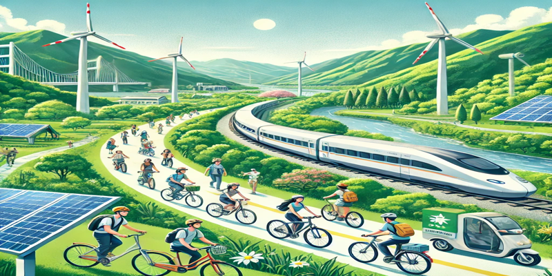

# 旅遊減碳
## 1. 旅遊減碳概論：理念與必要性

**介紹旅遊減碳的背景與意義**
- 全球氣候變遷與環境壓力
- 旅遊業*碳排放現況*分析
- 永續發展與<sub>資源</sub><sup>保護</sup>
- 政策驅動與<ins>國際趨勢</ins>
- **企業社會責任**與***品牌價值提升***
## 2. 碳足跡現況：旅遊業的挑戰
```
碳排放（kg CO₂） = 行駛距離（km） × 汽車排放係數（kg CO₂/km）
碳排放量 = 活動量 × 排放係數
```
分析旅遊業在環保議題中的現狀與挑戰
## 3. 策略與行動：低碳旅遊路徑
綠色交通鼓勵搭乘`公共運輸`、`電動車`及`自行車`，降低碳排放；綠色住宿則注重節能環保設計，提供低碳永續旅宿體驗，共創友善環境。\
探討具體的減碳策略\
與執行方案
## 4. 成功案例：綠色旅遊實踐分享
分享國內外在低碳旅遊領域的成功實例
## 5. 未來展望：邁向永續旅遊新時代
提出未來發展方向與推動永續旅遊的策略
